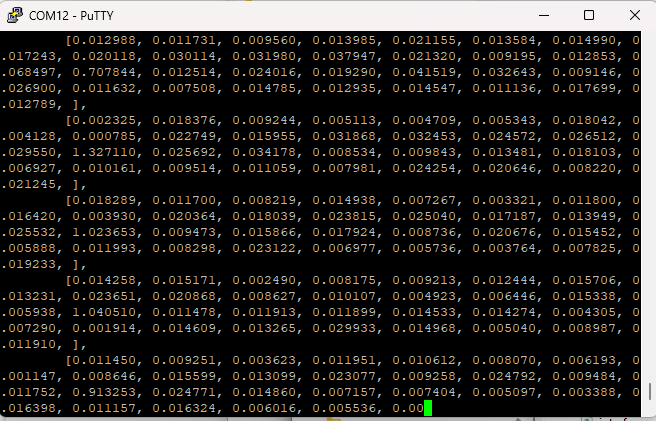

# IFX_BGT60_Psoc6_Range_Doppler_MAP
## Introduction
The Range Doppler Map processing for psoc6.

## Usage
### Input format
- This application works with [KIT_CSK_BGT60TR13C](https://www.infineon.com/cms/en/product/evaluation-boards/kit_csk_bgt60tr13c/)
- The configuration of the radar is
  ```
  "device_config": {
        "fmcw_single_shape": {
            "rx_antennas": [1,2,3],
            "tx_antennas": [1],
            "tx_power_level": 31,
            "if_gain_dB": 35,
            "lower_frequency_Hz": 60e9,
            "upper_frequency_Hz": 61e9,
            "num_chirps_per_frame": 32,
            "num_samples_per_chirp": 64,
            "chirp_repetition_time_s": 0.0005,
            "frame_repetition_time_s": 0.1,
            "sample_rate_Hz": 2000000
        }
    }
  ```

  
### Setup the application in ModusToolBox
```
git clone https://bitbucket.vih.infineon.com/projects/IFXSENSORHUB/repos/psoc6_rdm/browse
```

1. You can then use tool such as PuTTY to see the output of the psoc6 from UART 
2. You will see the doppler data those that can be copied to plot_doppler.py to see the doppler data.
3. Data will be save under test_embedded_python folder. 
4. Example Doppler image for Antenna 1: 


## Development
Please refer the the confluence [page](https://confluencewikiprod.intra.infineon.com/display/C3EMEAMKT/Model+Deployment).